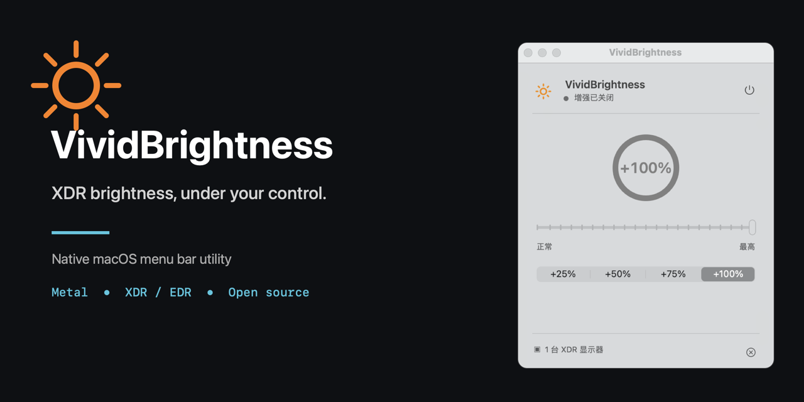
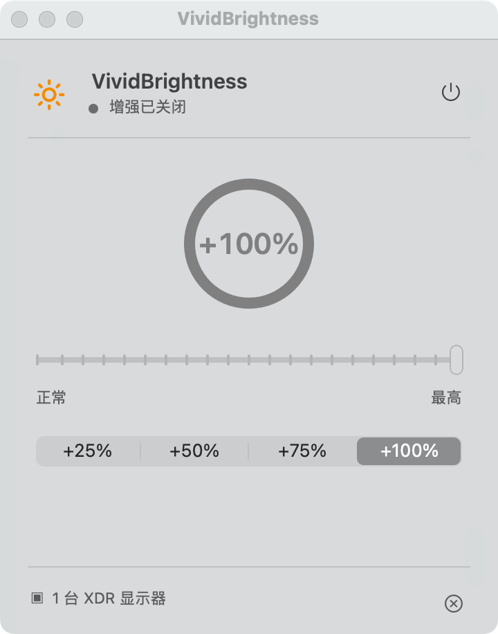

<p align="center">
  
</p>

<h1 align="center">VividBrightness</h1>

<p align="center"><strong>Open-source XDR/EDR brightness booster for macOS.</strong></p>

<p align="center">
  <a href="https://github.com/cold-summer/VividBrightness/releases/latest"></a>
  <a href="https://github.com/cold-summer/VividBrightness/actions/workflows/ci.yml"></a>
  
  <a href="LICENSE"></a>
</p>

<p align="center">
  <a href="https://github.com/cold-summer/VividBrightness/releases/latest"><strong>Download the latest DMG</strong></a>
  ·
  <a href="README.zh-CN.md">简体中文</a>
</p>

VividBrightness is a native macOS menu bar app that increases the physical light output of compatible XDR and EDR displays. It gives MacBook Pro Liquid Retina XDR and other supported displays up to a 2.0x brightness multiplier by using Apple's Extended Dynamic Range compositor and a 16-bit floating-point Metal overlay. It does not modify the display Gamma curve.

<p align="center">
  
</p>

## Why VividBrightness?

- **Real XDR/EDR output:** uses display luminance headroom instead of making the image look brighter with Gamma changes.
- **Precise control:** choose any level from 1.0x to 2.0x or use +25%, +50%, +75%, and +100% presets.
- **Native and lightweight:** built with AppKit and Metal, lives in the menu bar, and has no analytics or network requests.
- **Display-aware:** automatically targets only screens that expose EDR headroom to macOS.
- **Reliable lifecycle:** restores the overlay after wake and removes it immediately when disabled or quit.

## Compatibility

| Requirement | Support |
| --- | --- |
| macOS | macOS 13.0 or later |
| Release binary | Apple Silicon (`arm64`) |
| Built-in displays | MacBook Pro models with Liquid Retina XDR |
| External displays | Pro Display XDR and displays that expose EDR headroom to macOS |
| Standard SDR displays | Detected, but not modified |

A Metal-capable Mac is required. Actual available brightness is controlled by macOS and the display; the app cannot create EDR headroom on unsupported hardware.

## Download and Install

1. Download the Apple Silicon `.dmg` from the [latest GitHub Release](https://github.com/cold-summer/VividBrightness/releases/latest).
2. Open the DMG and drag `VividBrightness.app` to Applications.
3. Because the current binary is ad-hoc signed and not Apple-notarized, run this once in Terminal:

```bash
xattr -dr com.apple.quarantine /Applications/VividBrightness.app
open /Applications/VividBrightness.app
```

The release also includes a ZIP fallback and SHA-256 checksum files. Verify a download with:

```bash
shasum -a 256 -c VividBrightness-v1.0.0-macOS-arm64.dmg.sha256
```

## How It Works

VividBrightness renders an extended-linear Display P3 Metal surface with `RGBA16Float` pixels and opts the layer into EDR. A click-through full-screen window applies that surface with multiply compositing, allowing values above SDR white to use brightness headroom managed by macOS.

This is an XDR/EDR brightness enhancement, not a contrast filter or software Gamma adjustment. See [Architecture](docs/ARCHITECTURE.md) for the rendering pipeline, lifecycle, and system constraints.

## Build from Source

Install the Xcode Command Line Tools, then run:

```bash
git clone https://github.com/cold-summer/VividBrightness.git
cd VividBrightness
make check
make build
open .build/VividBrightness.app
```

Build metadata can be overridden without editing tracked files:

```bash
BUNDLE_IDENTIFIER=io.github.example.VividBrightness \
MARKETING_VERSION=1.0.0 \
BUILD_NUMBER=1 \
SIGN_IDENTITY="Developer ID Application: Example" \
make build
```

## Hardware Test

The real EDR integration test must run on an unlocked Mac connected to a compatible XDR/EDR display:

```bash
make test-edr
```

To inspect current and potential EDR headroom without enabling the overlay:

```bash
make diagnose
```

## Limitations and Safety

- macOS may reduce EDR headroom while the screen is locked, on battery power, or under thermal pressure.
- Sustained high brightness increases power consumption and display temperature; use +25% or +50% for long sessions.
- Reported EDR headroom is system capacity, not the selected brightness multiplier.
- The global `Command + Shift + B` shortcut may require Input Monitoring permission on some systems; menu bar controls do not.

## Contributing

Read [CONTRIBUTING.md](CONTRIBUTING.md) before opening a pull request. Security issues should follow [SECURITY.md](SECURITY.md), not the public issue tracker.

VividBrightness is available under the [MIT License](LICENSE).
